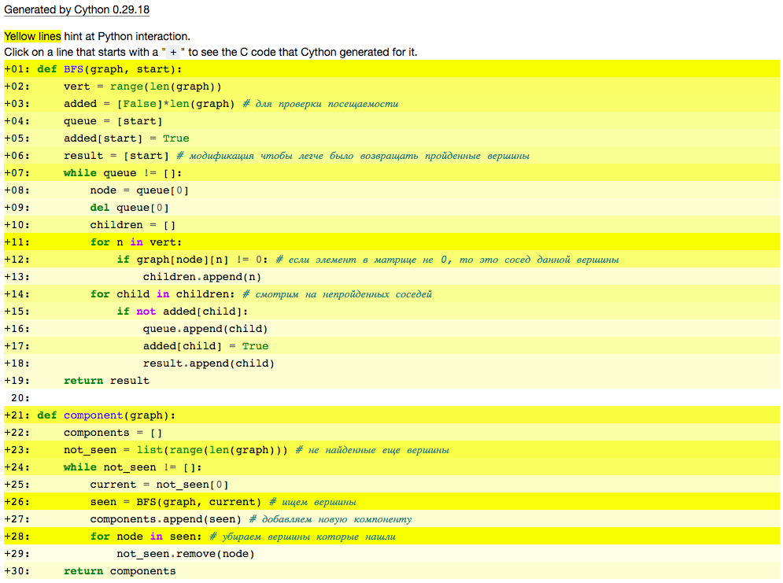

Будем оптимизировать поиск компонент в графе

```python
def BFS(graph, start):
    vert = range(len(graph))
    added = [False]*len(graph) # для проверки посещаемости
    queue = [start]
    added[start] = True
    result = [start] # модификация чтобы легче было возвращать пройденные вершины
    while queue != []:
        node = queue[0]
        del queue[0]
        children = []
        for n in vert:
            if graph[node][n] != 0: # если элемент в матрице не 0, то это сосед данной вершины
                children.append(n)
        for child in children: # смотрим на непройденных соседей
            if not added[child]:
                queue.append(child)
                added[child] = True
                result.append(child)
    return result
    
def component(graph):
    components = []
    not_seen = list(range(len(graph))) # не найденные еще вершины
    while not_seen != []:
        current = not_seen[0]
        seen = BFS(graph, current) # ищем вершины
        components.append(seen) # добавляем новую компоненту
        for node in seen: # убираем вершины которые нашли
            not_seen.remove(node)
    return components
```

Будем искать компоненты в графе с сотней вершин:

```python
graph = adjacency_matrix(100)
graph = random_split(graph)
```

```python
%%timeit
component(graph)
```

Результат:

    2.22 ms ± 252 µs per loop (mean ± std. dev. of 7 runs, 1000 loops each)

Используем cython и посмотрим, что получилось.


```python
%%timeit
component(graph)
```

Результат:

    608 µs ± 10.8 µs per loop (mean ± std. dev. of 7 runs, 1000 loops each)
    
Получили увеличение скорости в 3.65 раз
